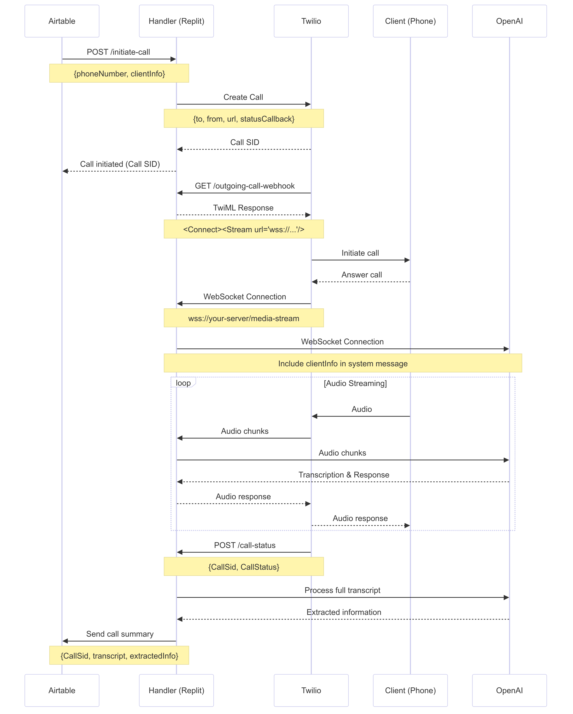

# Twilio Call System

This system integrates Twilio for voice calls with OpenAI for real-time conversation processing. Follow the instructions below to set up and use the system.

## 1. Twilio Setup

To configure Twilio to work with this system:

1. Sign up for a Twilio account if you haven't already.
2. Purchase a Twilio phone number that supports voice calls.
3. Log in to your Twilio console (https://www.twilio.com/console).
4. Navigate to the Phone Numbers section and select your Twilio number.
5. In the Voice & Fax section, configure the following:
   - For "A call comes in", set it to "Webhook" and enter:
     `https://2b38c62e-3467-4e43-86c5-217753ed44fb-00-ydlmvysiy7gx.janeway.replit.dev/incoming-call`
   - For "Call Status Changes", enter:
     `https://2b38c62e-3467-4e43-86c5-217753ed44fb-00-ydlmvysiy7gx.janeway.replit.dev/call-status`

6. (Optional) Create a TwiML App:
   - In the Twilio console, go to TwiML Apps under Programmable Voice.
   - Create a new TwiML App.
   - Set the Voice Request URL to:
     `https://2b38c62e-3467-4e43-86c5-217753ed44fb-00-ydlmvysiy7gx.janeway.replit.dev/outgoing-call-webhook`
   - Save the TwiML App SID for use when making outbound calls.

7. Note down your Twilio Account SID and Auth Token from the Twilio console.

## 2. Initiating a Call

To initiate a call, you need to send a POST request to the `/initiate-call` endpoint of your server. Here's how you can do it using JavaScript and the `fetch` API:

```javascript
async function initiateCall(phoneNumber, clientInfo) {
  const response = await fetch('https://2b38c62e-3467-4e43-86c5-217753ed44fb-00-ydlmvysiy7gx.janeway.replit.dev/initiate-call', {
    method: 'POST',
    headers: {
      'Content-Type': 'application/json',
    },
    body: JSON.stringify({
      phoneNumber: phoneNumber,
      clientInfo: clientInfo
    }),
  });

  if (!response.ok) {
    throw new Error(`HTTP error! status: ${response.status}`);
  }

  const result = await response.json();
  console.log('Call initiated:', result);
  return result;
}

// Example usage:
initiateCall('+1234567890', { name: 'John Doe', accountId: '12345' })
  .then(result => console.log('Call initiated successfully:', result))
  .catch(error => console.error('Error initiating call:', error));
```

This function sends a POST request to the `/initiate-call` endpoint with the following parameters:

- `phoneNumber`: The phone number to call (string)
- `clientInfo`: An object containing any additional information about the client that you want to include in the call context

The server will use this information to initiate the call through Twilio and set up the context for the conversation.

## 3. Updating the Prompt and OpenAI Config

The system prompt is stored in the `main_prompt.md` file in the root directory of the project.

RealTimeAPI session configuration is stored in `openai_config.json` file;

## 4. Provide keys
Create `.env` file in the root directory.
Provide all necessary keys. `VOICEFLOW_DESC` and `WEBHOOK_URL` are Optional.
```
OPENAI_API_KEY=
TWILIO_ACCOUNT_SID=
TWILIO_AUTH_TOKEN=
TWILIO_PHONE_NUMBER=
VOICEFLOW_API_KEY=
VOICEFLOW_DESC=
WEBHOOK_URL=
```

## Note

Ensure that your server is running and accessible at the URL specified in the Twilio configuration. 
If you change the server URL, remember to update the Twilio configuration accordingly.

## Requests sequence

